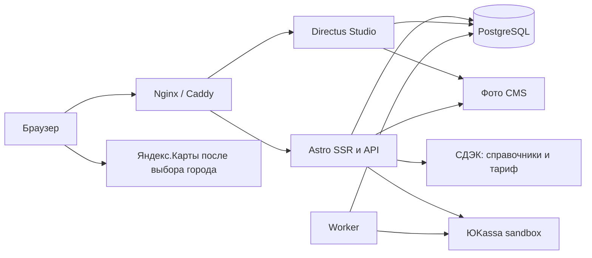

# Реализованная архитектура AUTO REELZ

Актуализировано 24.09.2026 по коду и миграциям001–011. [Карта кода](code-map.md) показывает, где выполнять конкретную правку. Продуктовые правила — [бриф](brief.md) и [решения](decisions.md).

## Потоки и границы

Astro отдаёт HTML выбранного SKU и серверные API. Интерактивность — обычный TypeScript, без React. Каталог читается через `ar_app` в repeatable-read snapshot; фильтры/поиск выполняются над DTO в `src/lib/catalog.ts`. Запрос перечитывает данные CMS, отдельный поисковый сервис и общий кеш не включены.

Directus редактирует каталог/контент. Торговые команды выполняет сервер с проверенной личностью сотрудника; Directus Flow или цепочка клиентских CRUD не заменяют транзакцию. DB-роли: `ar_migrator` — миграции, `ar_cms` — CMS, `ar_app` — приложение; `ar_catalog_reader` создан для ограниченного чтения, но runtime-пул витрины использует `ar_app`.

Worker из того же образа обрабатывает истечение выделений, тестовую почту/уведомления, сверку ЮKassa и heartbeat. Для очередной задачи не добавлять Redis/новый сервис без измеренной необходимости.

## Фактическая модель хранения

| Область | Основные таблицы / данные |
|---|---|
| Каталог | `ar_products`, `ar_skus`, `ar_categories`, `ar_product_categories` |
| Фото/характеристики | `directus_files`, `ar_product_media`, `ar_sku_media`, `ar_attributes`, `ar_attribute_values`, связи product/sku/category_attributes |
| Применимость | `ar_vehicles`, `ar_vehicle_versions`, `ar_fitment` |
| Комплекты/упаковки | `ar_bundle_components`, `ar_packages`, `ar_packing_rules` |
| Склад | `ar_stock`, `ar_stock_movements`; физические SKU, собственного остатка комплекта нет |
| Покупка | `ar_web_sessions`, `ar_carts`, `ar_cart_lines`, `ar_cart_quotes`, `ar_checkout_batches`, `ar_orders` |
| История заказа | JSON-снимки `items_snapshot`/`delivery_snapshot` и клиентские поля в `ar_orders`; таблицы `ar_order_components`, `ar_order_events`, `ar_order_notes` |
| Платежи | `ar_payments`, `ar_payment_events`; PSP attempt/lease/ключи добавлены миграцией010 |
| Авторизация/команды | `ar_customers`, `ar_login_challenges`, `ar_command_results`, ограничения запросов |
| Контент/социальное | `ar_pages`, `ar_articles`, категории/теги/связи/slug-history, `ar_favorites`, `ar_reviews`, `ar_review_media` |
| Фоновые операции | `ar_mail_outbox`, `ar_owner_notifications`, `ar_worker_heartbeat`, `ar_description_drafts`, `ar_delivery_events` |
| Подтверждения | `ar_checkout_batches.confirmation`, `ar_service_consents` (миграция011) |

Фото каталога лежат в uploads Directus; проверенные фото отзывов — в `bytea` БД. Рабочие записи/медиа отсутствуют в Git. Исторические snapshots заказа нельзя менять вслед за каталогом.

## Неизменные торговые правила

- Деньги: `numeric(16,2)` в PostgreSQL, строки `"1800.00"` в API/JSON, Decimal в расчётах. Float-арифметика для сумм запрещена. В CMS скидка — процент; внутренний код переводит его в basis points для функции расчёта.
- SKU имеет уникальный артикул без различия регистра; после создания перенос SKU в другой товар запрещён. Slug не является ID.
- Категории не глубже трёх уровней, без циклов. Публикация родителей, товара и SKU учитывается вместе.
- Фото/атрибуты/совместимость наследуются от товара или явно заменяются SKU. Отсутствие правила применимости означает unknown, не «подходит всем».
- Фильтры цены/наличия/атрибутов должны совпасть на одном исполнении. Нельзя получить ложное совпадение от разных SKU товара.
- Комплект состоит только из физических SKU; цена — сумма состава минус процент скидки. Общий спрос отдельных товаров и комплектов складывается до распределения запаса.
- При нехватке части количества вся строка идёт в предзаказ. Порядок добавления строк имеет значение. Смешанный состав создаёт два заказа с отдельной доставкой и оплатой.
- Обычный заказ резервирует на30минут; оплата списывает один раз. Предзаказ до подтверждения ничего не выделяет; подтверждение менеджером списывает весь обеспеченный состав и даёт30минут оплаты. Истечение/отмена возвращают выделенное однократно.
- Поздняя/несогласованная оплата → manual_review, без повторного списания и автоматической отправки.

## Текущий контракт checkout

1. `GET /api/commerce/session` выдаёт сессию/CSRF. Cookie HttpOnly/SameSite=Lax, Secure на HTTPS; срок30дней. Номер заказа не даёт права доступа.
2. `POST /api/commerce/cart`: товар/SKU, quantity, mode, cartVersion, idempotencyKey. Клиент последовательно сохраняет изменения; конфликт версии не затирает чужую правку.
3. `POST /api/commerce/delivery-estimate`: delivery + cartVersion, CSRF/Origin. Контактов не требует, quote/заказ/резерв не создаёт.
4. `POST /api/commerce/quote`: customer + delivery + cartVersion. Возвращает id, группы/суммы, срок и `confirmation` с версией/текстом тестовых условий.
5. `POST /api/commerce/checkout`: quoteId, cartVersion, idempotencyKey и `confirmation: {accepted: true, version: quote.confirmation.version}`. Сервер повторно проверяет данные, сохраняет принятую редакцию и время БД. Старым заказам подтверждение не приписывается.
6. `POST /api/commerce/pay`: orderId, shippingVersion, method, idempotencyKey. Цена берётся с сервера; результат возврата браузера не подтверждает оплату.

Публичные команды требуют проверки Origin/CSRF; исключения провайдеров имеют собственную проверку. В командах с идемпотентностью результат привязан к actor, ключу и хешу payload: повтор с другим телом отклоняется. Quote может создать новую запись расчёта, но не резервирует склад; delivery-estimate не сохраняет quote. После неизвестного исхода изменяющей операции повторяют тот же ключ, не создают новую оплату.

`STORE_MODE=production` сейчас блокируется тестовыми защитами торговых API/worker. Реальная торговля не включается одной сменой env. Старые контракты этапа4 читать вместе с этим дополнением.

## СДЭК и ЮKassa

Сеть СДЭК выполняется вне складских блокировок: прочитать/зафиксировать basis → запросить API → проверить актуальность basis → сохранить quote. Checkout под блокировкой сверяет состав/цену/распределение/упаковку, использует серверный снимок тарифа. Срок CDEK quote5минут; локальный симулятор quote10минут.

Одна упаковка SKU применяется к1шт.; для другого состава нужна точная `ar_packing_rules`. Размеры в БД — мм, масса — г; клиент СДЭК переводит размеры в см. Ошибка или отсутствие упаковки → стоимость null и уточнение менеджера до оплаты, а не бесплатная доставка.

Yandex SDK подключается автоматически после выбора города/загрузки ПВЗ по поручению24.09.2026; сами пункты/тарифы даёт СДЭК. Старые записи согласий сохраняются, новые автоматически не создаются; endpoint map-consent удалён. Список сохраняет работоспособность при ошибке карты. [Контракт СДЭК](cdek-checkout-contract.md).

ЮKassa сохраняет неизменяемую попытку, сумму, привязку к заказу/версии доставки и ключ провайдера. Вызов PSP вне SQL-транзакции; callback подтверждается аутентифицированным GET. Worker повторно проверяет незавершённые попытки. [Контракт ЮKassa](yookassa-checkout-contract.md). Отправления/провайдерские возвраты/чеки пока отдельные задачи.

## Остальная функциональность

- Гость хранит избранное в `autoreelz-favorites-guest-v2`; вход объединяет его с серверным списком без дублей и без передачи списка другому аккаунту. Личный счётчик не является количеством людей.
- OTP:10минут,5попыток, ограничения повторов/IP/email; успешный вход меняет токен/CSRF. Тестовые письма видит уполномоченный сотрудник в приватном inbox, внешней доставки нет.
- Отзыв допускается после полученного заказа и модерации. Недоверенные фото проверяются/перекодируются, неодобренные не публикуются.
- Генератор описаний пока имитатор: preview → ручное редактирование → apply с проверкой исходной версии. `seo_title` не перезаписывается.
- `src/lib/seo.ts` управляет SSR/schema/canonical; staging всегда noindex. Демо/черновики не превращать в реальные преимущества и юридические документы.

## Где заканчивается описание

Схема и исходники важнее старого концептуального названия таблицы в отчёте этапа. Точные новые поля вводить следующей миграцией; 001–011 не редактировать. Дизайн и интерфейсы не дают права на публикацию реальных платежей/писем. Текущие границы — [status.md](status.md), необходимые работы — [backlog.md](backlog.md).
