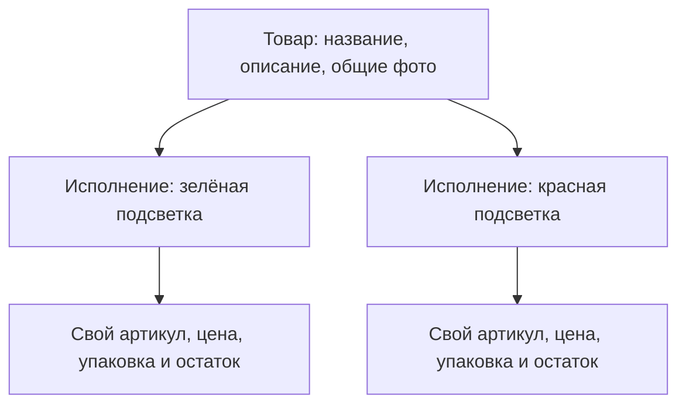
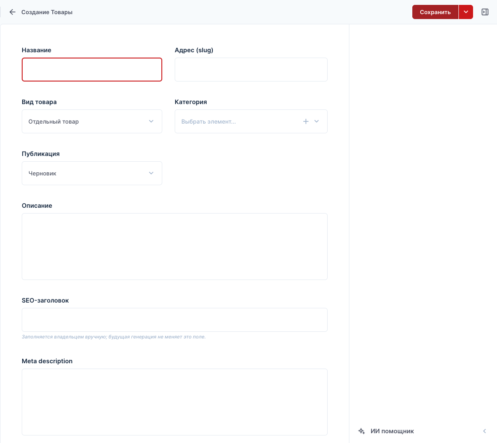
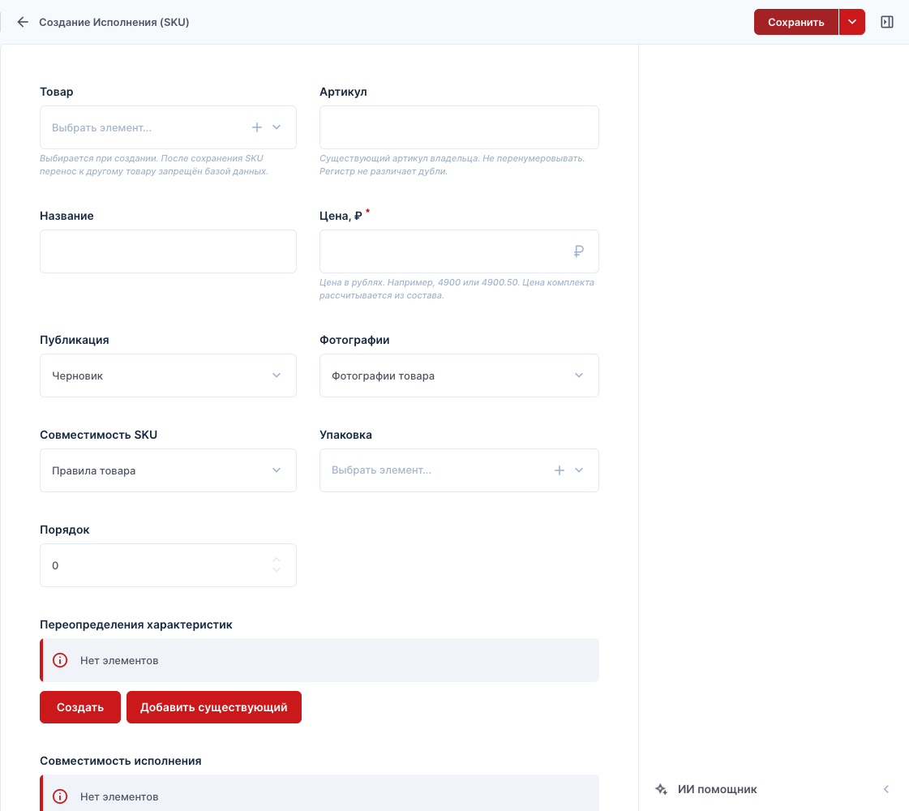
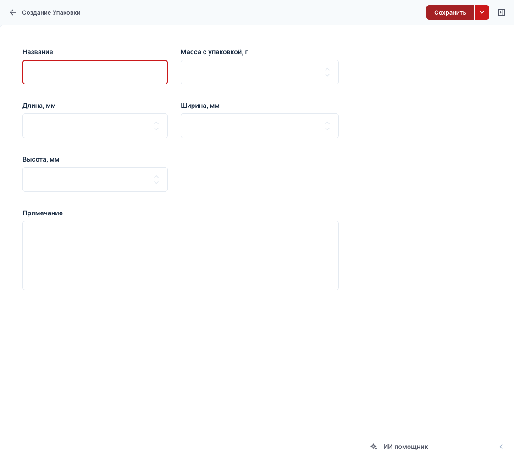

# Как добавить товар на AUTO REELZ

Инструкция владельцу, обновлена 03.10.2026. Для обычных товаров и комплектов используйте единую форму manager. Подробная инструкция CMS ниже остаётся полезной для справочников.

[Скачать PDF-инструкцию по новой форме, 6 страниц](../output/pdf/AUTO-REELZ-instruktsiya-dobavlenie-tovarov.pdf): шаги, скриншот, примеры и памятка. Версия 30.09.2026.

## Быстрое добавление в одной форме

1. Откройте [Кабинет → Товары](https://autoreelz.ru/manager/products) и нажмите **«+ Добавить товар»**.
2. Укажите **название, категорию и описание**, добавьте фотографии. Первое фото станет главным; порядок можно менять стрелками или перетаскиванием.
3. В блоке **«Цена и варианты»** заполните название исполнения, ваш артикул и цену в рублях. Для одного исполнения можно использовать понятную подпись «Стандартное исполнение». Для разных цветов нажмите **«+ Добавить вариант»**.
4. Для нового исполнения внесите фактический начальный остаток и причину, если количество больше нуля. Приход будет проведён **один раз при публикации**, а не при сохранении черновика. Для существующего исполнения показаны текущие числа и ссылка на склад.
5. Раскройте **«Упаковка для доставки»**. Здесь размеры вводятся **в сантиметрах**, вес — **в граммах вместе с упаковкой**. Пример: `22 × 10 × 4`, вес `200`. Система сама переведёт размеры в миллиметры. Для одинаковых вариантов есть кнопка применения упаковки ко всем.
6. При необходимости раскройте **характеристики и совместимость**, а также **адрес страницы и SEO**. Адрес предлагается из названия. Фото и правила конкретного варианта доступны в его дополнительном блоке.
7. Нажмите **«Сохранить черновик»**, чтобы продолжить позже, или **«Опубликовать»**, чтобы показать готовый товар. Неполные черновики доступны сверху списка товаров. У уже опубликованной карточки черновик сохраняется отдельно: посетители видят прежнюю версию до публикации.
8. После публикации нажмите **«Открыть на сайте»**, проверьте варианты, фото, цену и корзину.

**Описание можно подготовить с ИИ.** Раскройте «Помощник для описания», при необходимости добавьте проверенные факты и нажмите «Сгенерировать описание». Проверьте два текста, затем «Применить в черновик». SEO-заголовок остаётся ручным; сохранение/публикация выполняются отдельно. Общий бюджет — до $5/месяц. [Подробности и обработка ошибок](ai-text-generation.md).

**Чтобы изменить существующий товар**, найдите его в списке и нажмите **«Редактировать»**. Остатки уже созданных исполнений меняются через «Склад», чтобы редактирование описания случайно не внесло повторный приход.

Если система сообщила о правках в другой вкладке/CMS, не перезаписывайте их вслепую. Сравните данные; при необходимости нажмите **«Сбросить черновик и загрузить карточку»**. Это удалит сохранённые и несохранённые правки формы после подтверждения, но сохранит опубликованный товар и склад.

Форма поддерживает отдельные товары с вариантами и **готовые комплекты**. Для комплекта откройте **Товары → Создать комплект**; подробнее — [редактор комплектов](bundle-editor.md).

## Подробный порядок через CMS

Скриншоты ниже — пустые формы настоящей админки. В CMS размеры упаковки по-прежнему вводятся в миллиметрах; сантиметры используются именно в новой форме кабинета.

**Основной порядок:** карточка товара → фотографии и характеристики → исполнение с ценой → упаковка → остаток → публикация.

## Где работать

| Что нужно сделать | Куда перейти |
|---|---|
| Создать карточку, изменить описание и фото | [CMS → Товары](https://autoreelz.ru/cms/admin/content/ar_products) |
| Добавить вариант, изменить артикул и цену | [CMS → Исполнения (SKU)](https://autoreelz.ru/cms/admin/content/ar_skus) |
| Указать массу и размеры | [CMS → Упаковки](https://autoreelz.ru/cms/admin/content/ar_packages) |
| Внести поступление или пересчитать остаток | [Кабинет → Склад](https://autoreelz.ru/manager/stock) |
| Проверить заполненность карточек | [Кабинет → Товары](https://autoreelz.ru/manager/products) |

Используйте выданный аккаунт администратора. Раздел «Товары» кабинета содержит создание/редактирование обычных товаров, черновики, проверку заполненности и ссылки в CMS.

## 1. Подготовьте данные и проверьте дубли

Нужны: название, категория, описание, фотографии, фактический артикул каждого исполнения, цена в рублях, количество на складе, масса и размеры упакованного товара. Совместимость и характеристики заполняйте по подтверждённым данным.

Сначала найдите артикул в «Исполнениях (SKU)». Часть ассортимента уже перенесена из Wildberries. Если исполнение существует, редактируйте его; заново создавать его и повторно вносить начальный остаток не нужно.

**Товар и исполнение — две связанные записи:**

Это схема для примера, а не перечень существующих вариантов. Если вариант только один, всё равно создайте одно исполнение. Разные цвета одного изделия обычно удобно объединить в одну карточку, если покупатель выбирает между ними.

## 2. Создайте карточку в черновике

Откройте **«Товары» → «Создать»**.

| Поле | Что указать |
|---|---|
| Название | Понятное название изделия: что это и для какого автомобиля, если применимость подтверждена |
| Адрес (slug) | Уникальный адрес латиницей в нижнем регистре, с цифрами и дефисами, без пробелов. Например, `nazvanie-tovara` |
| Вид товара | **Отдельный товар**. Комплекты описаны ниже |
| Категория | Выберите существующую подходящую категорию |
| Публикация | Пока **Черновик** |
| Описание | Назначение, что входит в поставку, особенности, ограничения и важные условия установки |
| SEO-заголовок | Краткое название страницы, например «Название товара — AUTO REELZ» |
| Meta description | Одно-два предложения о конкретном товаре без неподтверждённых обещаний |
| Демонстрационные данные | Для настоящего товара выключено |

В выборе категории нажмите **«Выбрать элемент…»**, выберите строку и сохраните выбор. Затем нажмите **«Сохранить»** в правом верхнем углу самой карточки. Откройте сохранённый товар для добавления связанных данных.

В описание достаточно вводить обычный текст с абзацами. Генератор описаний пока работает как имитатор; для наполнения пользуйтесь ручным текстом.

## 3. Добавьте фотографии

В карточке товара прокрутите до **«Фотографии товара» → «Создать»**:

1. В поле **«Файл»** загрузите изображение или выберите уже загруженное.
2. В **«Описание изображения»** кратко напишите, что видно: например, «Блок отопителя, вид спереди».
3. Укажите **«Порядок»**: `1` для главного фото, `2` для следующего и так далее. Меньшее число показывается раньше.
4. Сохраните связанную запись и основную карточку товара. Повторите для остальных фото.

Рекомендуемая последовательность галереи:

| 1 — главное фото | 2 — второй ракурс | 3 — детали | 4 — комплектность | 5 — установка |
|---|---|---|---|---|
| Товар целиком, хорошо различим | Вид сзади или сбоку | Разъёмы, крепления, фактура | Всё, что получает покупатель | Реальный вид в салоне, если есть фото |

Это рекомендации по оформлению, а не обязательное количество изображений. Используйте чёткие JPG, PNG или WebP; сохраняйте одинаковый фон и масштаб по возможности. Важные характеристики повторяйте текстом, чтобы их можно было прочитать без увеличения фотографии.

**Общие фото добавляйте именно в товар:** они используются в карточках каталога. Если у конкретного исполнения свои фотографии, в нём выберите **«Фотографии → Собственные фотографии»** и заполните **«Фотографии исполнения»**. Этот режим полностью заменяет общую галерею для выбранного исполнения, поэтому пустым его оставлять не стоит.

## 4. Заполните характеристики и совместимость

В **«Характеристики товара» → «Создать»** выберите характеристику и её значение. Заполняйте только одно поле значения согласно типу: справочник, текст, число или «да/нет». Общие характеристики действуют на все исполнения; отличия конкретного варианта задаются в **«Переопределениях характеристик»** этого исполнения.

В **«Совместимость товара» → «Создать»** выберите автомобиль, при необходимости его модификацию, годы и наличие кондиционера. Статус **«Подходит»** используйте только при подтверждённой применимости. Если данных нет — **«Не подтверждено»**; неизвестные годы оставьте пустыми. Приора 1 и Приора 2 — разные записи. «Не влияет» для кондиционера тоже требует подтверждения.

Обычно исполнение использует **«Совместимость SKU → Правила товара»**. Если правила вариантов действительно различаются, выберите **«Собственные правила SKU»** и заполните полный набор правил в **«Совместимость исполнения»**: общие правила в этом режиме заменяются.

Для нового признака используется справочник «Характеристики» и его связь с категорией. Изменять технические настройки CMS для каждого нового цвета или материала не нужно.

## 5. Создайте исполнение и укажите цену

В карточке товара нажмите **«Исполнения товара → Создать»**. Другой путь: **«Исполнения (SKU) → Создать»**, затем выбрать ранее сохранённый товар.

| Поле | Что указать |
|---|---|
| Товар | Карточка, созданная на шаге 2. Проверьте выбор до сохранения |
| Артикул | Ваш существующий уникальный артикул, без перенумерации. Разница только в регистре не делает его новым |
| Название | Название исполнения, понятное покупателю: цвет, подсветка или другое реальное отличие |
| Цена, ₽ | `1800` означает **1 800 ₽**; `1800.50` — **1 800,50 ₽**. Умножать на 100 не нужно |
| Публикация | До завершения заполнения — **Черновик** |
| Фотографии | **Фотографии товара**, если общая галерея подходит |
| Совместимость SKU | **Правила товара**, если применимость общая |
| Упаковка | Выберите на следующем шаге |
| Порядок | Очерёдность исполнения в карточке: меньшее число раньше |

Если вариантов несколько, повторите этот шаг для каждого: собственные артикул, цена, упаковка и складской остаток. После сохранения перенос исполнения к другому товару запрещён — важно сразу выбрать правильную карточку.

## 6. Привяжите упаковку для СДЭК

В поле **«Упаковка»** выберите подходящую существующую запись. Если такой нет, создайте её в разделе **«Упаковки»**, затем вернитесь к исполнению и выберите её.

Указывайте **массу вместе с упаковкой и внешние размеры готовой посылки**. В текущей CMS размеры вводятся в миллиметрах:

| Ваш замер | Поле CMS | Ввести |
|---|---|---|
| 200 граммов | Масса с упаковкой, г | `200` |
| 22 сантиметра | Длина, мм | `220` |
| 10 сантиметров | Ширина, мм | `100` |
| 4 сантиметра | Высота, мм | `40` |

Название упаковки можно сделать понятным: «Коробка 22 × 10 × 4 см, 200 г». Пример основан на ранее переданных размерах блока отопителя; для нового товара нужны его собственные замеры. Существующий товар «гранта зеленая» повторно создавать не нужно.

После выбора упаковки **сохраните исполнение**. Без данных упаковки автоматический расчёт доставки может перейти на ручное уточнение. Для нескольких товаров или комплекта нужна подходящая проверенная коробка/правило упаковки; складывать длины, ширины и высоты товаров нельзя.

## 7. Внесите реальное количество на складе

Откройте [«Склад»](https://autoreelz.ru/manager/stock) и найдите исполнение по артикулу.

| Ситуация | Кнопка | Что вводить |
|---|---|---|
| Новый товар или новое поступление | **Приход** | Сколько единиц **добавилось**, и причину. Подтвердить: **«Принять на склад»** |
| Пересчитали уже существующий запас | **Остаток** | Сколько единиц **всего есть физически**, и причину. Подтвердить: **«Сохранить остаток»** |
| Нужно понять изменение количества | **История** | Посмотреть движения и причины |

Пример: было 7, получили ещё 3 → **«Приход: 3»** → станет 10. При пересчёте обнаружили всего 9 → **«Остаток: 9»** → станет 9.

Первый приход допустим только по фактическому подсчёту. Не повторяйте его после каждого редактирования карточки: он каждый раз увеличивает количество. Свободное количество равно физическому остатку минус резерв; ниже действующего резерва остаток уменьшить нельзя.

При нулевом свободном остатке товар доступен как предзаказ. Если его вообще нельзя предлагать покупателям, снимите исполнение с публикации, а не просто обнулите склад.

## 8. Опубликуйте и проверьте как покупатель

1. В каждом готовом исполнении выберите **«Публикация → Опубликовано»** и сохраните.
2. В самой карточке товара также выберите **«Опубликовано»** и сохраните. Основная категория и её родительские разделы тоже должны быть опубликованы.
3. Откройте [каталог магазина](https://autoreelz.ru/catalog) в новой вкладке, найдите товар по названию или артикулу. Для прямого адреса используйте `/product/ваш-slug` на домене магазина.
4. Проверьте фото, описание, каждое исполнение, артикул, цену, характеристики, совместимость и наличие. Посмотрите карточку с телефона.
5. Добавьте нужное исполнение в корзину и проверьте, что выбраны правильные вариант и цена. При необходимости проверьте расчёт СДЭК; создавать заказ ради проверки карточки не требуется.

Изменения контента появляются при следующей загрузке страницы — отдельная публикация кода не нужна. Проверяйте товар именно в каталоге: главная показывает подборку и не обязана сразу включать каждую новую карточку. Сайт пока работает в тестовом режиме оплаты.

**Короткая проверка перед публикацией:**

- [ ] Нет дубля товара/артикула; настоящая карточка не отмечена демонстрационной.
- [ ] Главное фото находится в общих фотографиях товара; порядок галереи задан.
- [ ] Есть хотя бы одно готовое исполнение с правильной ценой в рублях.
- [ ] Фото и совместимость выбранного исполнения соответствуют его варианту.
- [ ] Упаковка привязана, граммы и миллиметры проверены.
- [ ] Остаток внесён по факту без повторного прихода.
- [ ] Опубликованы товар, нужные исполнения и основная категория с родителями.
- [ ] Карточка и корзина проверены на сайте.

## Если что-то не получилось

| Проблема | Что проверить |
|---|---|
| Товара нет на сайте | Статус товара, основную категорию и её родителей; снимите фильтры каталога |
| Нет нужного варианта или предложения для покупки | Создано ли исполнение именно у этого товара и опубликовано ли оно |
| Цена в 100 раз больше | В «Цена, ₽» должны быть рубли: `1800`, а не `180000` |
| Видна заглушка вместо фото | Общие фото товара; для собственного режима — заполнение галереи исполнения; сохранение обеих форм |
| Показывается предзаказ | Свободный остаток конкретного артикула, включая резерв |
| Не получается рассчитать доставку | Привязку упаковки, массу и размеры; для сборной посылки — правила коробок; также возможен сбой перевозчика |
| Не сохраняется артикул или адрес | Уникальность значения, отсутствие пробелов в slug; менять регистр артикула ради обхода дубля не нужно |

## Если добавляете готовый комплект

В manager откройте **Товары → Создать комплект**. Заполните название, категорию и описание. В разделе **«Состав и цена комплекта»** найдите товары по названию, цвету или артикулу и нажмите **«Добавить»** у нужных исполнений. Укажите количество каждого компонента и скидку. Кнопка **«Взять фото компонентов»** добавит их снимки в общую галерею без повторов; можно загрузить отдельное фото всего комплекта. Сначала сохраните черновик, затем проверьте и опубликуйте. Существующие комплекты открываются кнопкой **«Редактировать»** в списке товаров.

Цена считается из цен составляющих с учётом скидки, наличие — из их свободных остатков. Отдельное исполнение, ручная цена и собственный склад для комплекта не создаются. Проверьте состав и упаковку комплекта до публикации.

---

Остальные операции: [руководство кабинета](manager-guide.md). Возможности и ограничения новой формы: [контракт редактора](product-editor-proposal.md).

## Инфографика и удаление фона

В студии есть отдельный пункт **«Форма фона»**: скруглённая панель, диагональ, арка, волна, круг и две панели. Цвет выбирается отдельно. Чтобы обновить ранее сохранённую картинку, соберите её заново с нужной формой.

В блоке «Фотографии» нажмите **«Создать инфографику»**. Сначала загрузите обычные исходные фото товара. Выберите главное фото и, при необходимости, второй ракурс; задайте оформление, цвет и короткие подтверждённые надписи.

Откройте «Удаление фона и положение фото», выберите нужный ракурс и нажмите «Удалить фон». Проверьте края. Кисть «Стереть» удаляет лишнее, «Вернуть» восстанавливает участок исходного фото; доступны три отмены и возврат всего исходника. Масштаб и смещение меняются ползунками.

«Скачать PNG» сохраняет картинку на компьютер. «Добавить в галерею» добавляет отдельную картинку в форму; исходное фото не заменяется. При необходимости переместите результат на первое место стрелками. Затем нажмите «Сохранить черновик» либо отдельно «Опубликовать». Настройки студии и правки маски сохраняются вместе с формой. Закрытие окна само по себе не сохраняет их на сервере.

Формат первой версии —1500×1000, три оформления. Генератор не придумывает совместимость и свойства и не обращается кGPT. Исходник из галереи уже нормализован штатной загрузкой до1600px; полный файл камеры остаётся у вас. Подробности — [product-infographics.md](product-infographics.md). PDF-инструкция описывает основной редактор, без новой студии.
